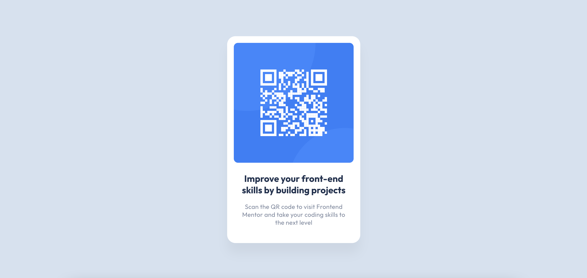

# Frontend Mentor - QR code component solution

This is a solution to the [QR code component challenge on Frontend Mentor](https://www.frontendmentor.io/challenges/qr-code-component-iux_sIO_H). Frontend Mentor challenges help you improve your coding skills by building realistic projects. 

## Table of contents

- [Overview](#overview)
  - [Screenshot](#screenshot)
  - [Links](#links)
- [My process](#my-process)
  - [Built with](#built-with)
  - [What I learned](#what-i-learned)
  - [Continued development](#continued-development)
  - [Useful resources](#useful-resources)
- [Author](#author)

## Overview

### Screenshot



### Links

- Solution URL: [Add solution URL here](https://your-solution-url.com)
- Live Site URL: [Add live site URL here](https://hchao7.github.io/QR-code-component/)

## My process

### Built with

- Semantic HTML5 markup
- Flexbox
- BEM Methodology

### What I learned

I learned that it can be very helpful to start out with a CSS reset. I used Josh Comeau's CSS reset, which "undos" certain browser defaults. For example, `box-sizing: content-box` is set to `border-box`, which makes CSS much easier to work with. 

I also learned about the BEM methodology. I know this is a very simple and small project to be applying a methodology to, but since there are so many ways to style a page, I thought following a methodology might guide my planning. 

```css
/* Block */
.card {}

/* Elements */
.card__qr-code {}
.card__heading {}
.card__paragraph {}
```

If you want more help with writing markdown, we'd recommend checking out [The Markdown Guide](https://www.markdownguide.org/) to learn more.

### Continued development

I would like more experience with layout-related properties, such as Flexbox. For the project, I only used Flexbox to center a `main` element, which was pretty simple to figure out.

I did use Sass for this project, but my CSS is quite simple, so I did not use it very effectively. I will try to take better advantage of Sass when writing more advanced CSS syntax.

### Useful resources

- [Custom CSS Reset](https://www.joshwcomeau.com/css/custom-css-reset/) - This helped me reset the browser default styles.
- [BEM Methodology](https://getbem.com/naming/) - This helped me understand the basics of BEM. Hopefully I applied it correctly!

## Author

- Frontend Mentor - [@hchao7](https://www.frontendmentor.io/profile/hchao7)

